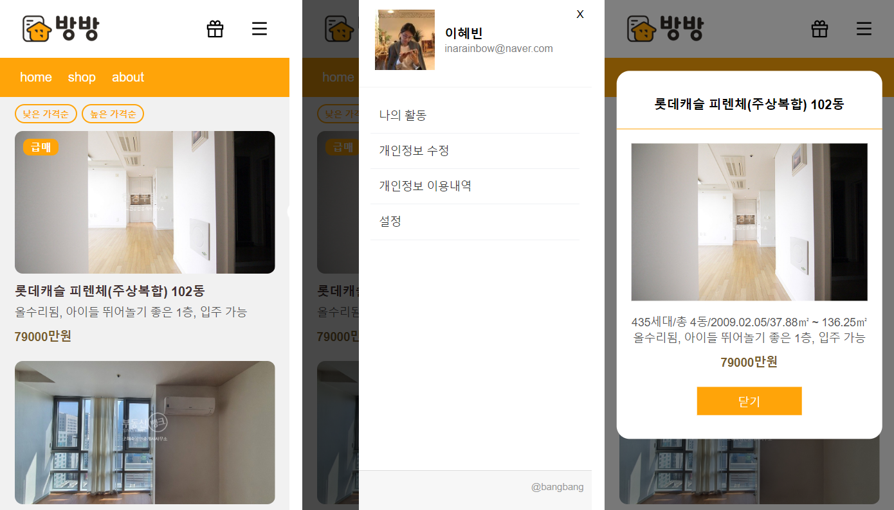

# 집구하기 App

매물이름, 매물사진, 가격등의 가상 데이터를 작성하여 목록을 나타내는 Vue 모바일 웹페이지 입니다.

- 가상 데이터 목록에 작성되어 있는 만큼의 상품매물이 표시되며, 급매물인 상품인 경우 이미지에 '급매' flag가 표시됩니다.
- '낮은 가격순', '높은 가격순' 버튼을 클릭하면 각각 오름차순, 내림차순 목록 재정렬 됩니다. 
- 매물 목록 클릭시 팝업창 열리며 상세 매물정보 확인할수 있도록 하였습니다.
- 오른쪽 상단 메뉴버튼 클릭시 사이드 메뉴 열리며, 닫기 또는 딤영역 클릭시 닫힘니다
- 헤더, 메인이미지, 영화리스트, 푸터의 컴포넌트로 나누어져 있으며, 함수 방식의 리액트 사용하여 작성되었습니다.

